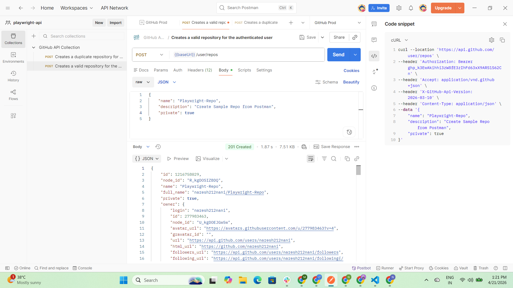
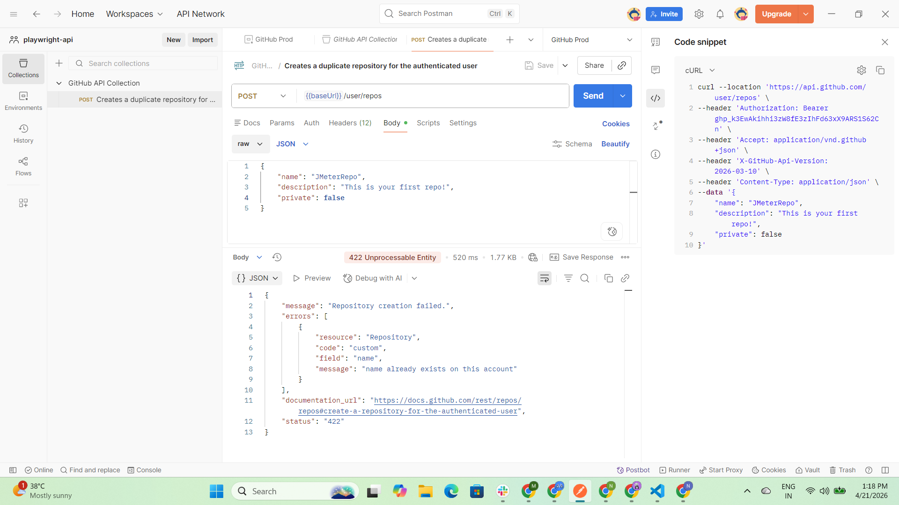

# API Testing

## What is API?

API is a combination of a set of routines, protocols, and supporting tools used in the background to create a connection between your application UI and backend server to exchange information.

# What is the difference between API, Web Service and Microservice ?

## Web Service

Web service is a type of API that is going to run over the internet or web.

## Micro Service

Microservice is a tiny API that we are going to use within the application to communicate and share the information between different components of the application.

## What is API testing? Why is it important?

API testing is a type of software testing that involves testing APIs directly without using application UI.

## Benefits of API testing ?

1. Early issue detection
2. Faster execution compared to UI
3. Completely independent from UI changes
4. Broader test coverage.
5. API testing is automation friendly.

## Only API testing is enough to release the product ?

NO

# Popular API architectures ?

## SOAP

## REST

## GRAPHQL

## SOAP (simple Object Access Protocol)

SOAP services mainly rely on XML format to provide messaging services. Each SOAP service is mainly used for POST requests to send and receive the information.

POST /webservice HTTP/1.1
Host: example.com
Content-Type: text/xml; charset=utf-8
Content-Length: length

<soap:Envelope xmlns:soap="http://www.w3.org/2003/05/soap-envelope">
<soap:Header/>
<soap:Body>
<GetUserDetails xmlns="http://example.com/">
<UserId>12345</UserId>
</GetUserDetails>
</soap:Body>
</soap:Envelope>

<soap:Envelope xmlns:soap="http://www.w3.org/2003/05/soap-envelope">
<soap:Header/>
<soap:Body>
<GetUserDetails xmlns="http://example.com/">
<Username>Bharath Reddy</Username>
<Userrole>Senior SDET</Userrole>
</GetUserDetails>
</soap:Body>
</soap:Envelope>

## REST (Representational State Transfer)

RESTful services mainly use JSON format instead of using XML to exchange the information. RESTful services will use different HTTP methods to perform different types of operations. Like GET, POST, PUT, PATCH and DELETE

POST api.example.com/users/12345 HTTP/1.1

{
"role" : "QA"
}
Host: api.example.com
Accept: application/json

Response:
{
"id": 12345,
"name": "John Doe",
"email": "johndoe@example.com"
}

GET - when we want to search and retrieve existing data from the server
POST - when we want to store new information within the backend server
PUT - when we want to update the existing information from the server
PATCH - when we want to modify part of the information or part of the record
DELETE - when we want to delete the information from the server

## GRAPHQL

GraphQL is going to allow us to send a request from the client to retrive specific data. So it is going to reduce over-fetching and under-fetching of the data.

POST /graphql HTTP/1.1
Host: api.example.com
Content-Type: application/json

{
"query": "{ user(id: \"12345\") { name, email } }"
}

Response:
{
"data": {
"user": {
"name": "John Doe",
"email": "johndoe@example.com"
}
}
}

## How to validate RESTful services?

## API Requirements ?

### Requirements to be collected from our developer to send the request ?

1. Purpose of API request or functionality of API ?

2. Request type means what kind of request it is:

- GET
- POST
- PUT
- PATCH
- DELETE

3. Request URL : Request URL contains: (Example: GET https://api.amazon.com/{category}/{product}?price<=50000 )

- base URL : https://api.amazon.com (the server URL that is constant for each and every request)
- endpoint : /{category}/{product}?price<=50000 (inside the server, where exactly is the actual information available?)
- path parameters : {category} ,{product} (the data that is changing dynamically within the endpoint)
- query parameters : ?price<=50000 (starts with a question mark to filter the search results coming from the backend server)

4. Request body or payload :
   The data that we want to store within the server are the data that you want to update within the server.
   {
   "name":"bharath",
   "email":"bharath@test.com"
   }

5.Authorization and authentication

- Authentication is all about "Who are you?"
- Authorization is all about "what you are allowed to do?"

Just like UI, there are different authorization mechanisms we can implement while building the APIs.

- No Auth : No authorization required. It's an open API.
- Basic auth : Access the data through basic authorization like username and password.
- API Key : Unique key generated by the developer along with a unique value that needs to be used to access the information from the server.
- Bearer token or JWT token : Unique token generated by the developer to access the information based on the user roles and permissions along with Expiry date
- OAuth : Open Authorization => What is all about maintaining additional security by adding additional layers. In OAuth, the user is going to get a consumer key and secret along with an access token to generate the temporary bearer token. Through that temporary bearer token, we can access the information.

6. Request Headers : Request headers are nothing but the additional meta data to be shared along with the API request.
   {
   "Content-Type": "application/json",
   "Accept": "application/vnd.github.v3+json",
   "Authorization": "Bearer <YOUR-TOKEN>"
   }

### Requirements to be collected from our developer to validate the response ?

1. Response Code or Status Code : Response code is all about the unique number generated by the server every time a request is completed. Based on the response code, we can understand the status of our request.

1XX => Informational Codes (processing)
2XX => Symbol of success. (200-OK ,201-Created ,204-No Content)
3XX => Redirect Status Codes
4XX => Client-side error. (400-Bad Request , 401 - Unauthorized , 404 - Not Found , 422 - Unprocessable Entity )
5XX => Server-side error (500 - Internal server error. , 502 - Bad Gateway , 503 - Service Unavailable , 504 - Gateway timeout )

2. Sample Response Body
   GET https://api.amazon.com/mobiles/iphone16?price<=50000

{
"mobiles" :{
"product":"Iphone 16",
"price": 49999,
"RAM" : "16Gb"
}
}

3. Schema of the API response
   Schema: meaning the nature of the data that we are expecting within the response.
   "mobiles" : object
   "product":string
   "price":number
   "RAM":string

4. Response headers
   "session-id" : "dgjhwgfdrwq4352367512"

5. Maximum time it can take to give us the response
   ResponseTime : 2 sec

6. Error validations and error handling
   For each and every invalid user request, what kind of outcome or what kind of error message are we expecting from the server, along with the status code.

7. Cookies (If applicable)
   The data or the information that will be downloaded and shared with the user along with the actual response every time we are sending the request

## API TESTING - GITHUB API

Application : https://github.com/
API Documentation : https://docs.github.com/en/rest/repos/repos

GIT Account : bharathtechacademy05
GIT TOKEN: Bearer TOKEN

## Scenarios:

1. Creating a duplicate repository with valid credentials.
2. Creating a valid repository with valid credentials.
3. Search and get existing repository with valid credentials.
4. Update the existing repository with valid credentials.
5. Delete the existing repository with valid credentials.

# How to Use POSTMAN tool (Step By Step)

1. Creating the Postman Workspace (Workspace -> Create -> Blank Workspace -> Update Name -> Create)
2. Creating /Adding Environment (to store all the configuration details) (Environments -> Create -> Update Name)
3. Add the Api Collection (Collections -> Create -> Update Name)
4. Adding API Requests inside the API Collection (Hover on collection -> Add Request -> Update Request Details)

# API Documentation

## 1. Creating a duplicate repository with valid credentials.

### Purpose : Create a repository for the authenticated user

### Request type : post

### Request URL : https://api.github.com/user/repos

### Request Body :

- - name string Required
    The name of the repository.

description string
A short description of the repository.

private boolean
Whether the repository is private.
Default: false

### Authorization Mechanism :

"Authorization: Bearer TOKEN"

Generate Token : Profile -> Settings -> Developer Settings -> Personal access tokens -> Tokens (Classic) -> Generate new token -> Generate new token(classic)
or
after login -> go to "https://github.com/settings/tokens/new"

### Headers:

-H "Accept: application/vnd.github+json" \
-H "Authorization: Bearer <TOKEN>" \
-H "X-GitHub-Api-Version: 2026-03-10" \

### Expected Status:

Status: 201

### Expected Response Body:

{
"id": 1296269,
"node_id": "MDEwOlJlcG9zaXRvcnkxMjk2MjY5",
"name": "Hello-World",
"full_name": "octocat/Hello-World",
"owner": {
"login": "octocat",
"id": 1,
"node_id": "MDQ6VXNlcjE=",
"avatar_url": "https://github.com/images/error/octocat_happy.gif",
"gravatar_id": "",
"url": "https://api.github.com/users/octocat",
"html_url": "https://github.com/octocat",
"followers_url": "https://api.github.com/users/octocat/followers",
"following_url": "https://api.github.com/users/octocat/following{/other_user}",
}}

### Expected Response Schema:

{
"title": "Full Repository",
"description": "Full Repository",
"type": "object",
"properties": {
"id": {
"type": "integer",
"format": "int64"
},
"node_id": {
"type": "string"
},
"name": {
"type": "string"
},
"full_name": {
"type": "string"
}}}

